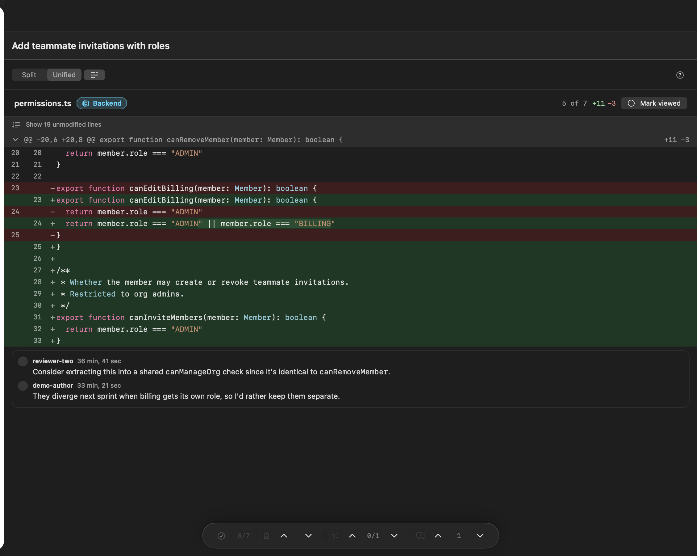

# Reviewrr

Review pull and merge requests without leaving your Mac.

A native SwiftUI app for macOS 14 and later. There is no server and no daemon: it talks
directly to GitHub, GitHub Enterprise Server and self-managed GitLab, and keeps everything
local — credentials in the Keychain, drafts and caches under Application Support.



<sub>The demo pull request, which runs offline — no account needed to try it.</sub>

## Why

Reviewing in a browser tab means a diff that scrolls the whole page, comments that lose your
place, and no memory of which files you have already read. Reviewrr keeps one pull request in
one window: the file tree on the left with your progress on it, the diff in the middle, and
the conversation or AI panel on the right. Drafts are yours until you submit them.

## What it does

**A dashboard, across every host at once.** Watched projects and a cross-repository inbox.
A GitHub repository and a GitLab project sync side by side — each against its own host — and
your review queue is merged from all of them rather than whichever one is selected.

**A review workspace built for reading.** Split or unified diff, syntax highlighting,
word-level diffs inside a changed line, expandable context, and a file tree that tracks what
you have marked viewed. `n` and `p` step between actual changes — not hunk headers — and carry
on into the next file rather than dead-ending at the bottom of one.

**Drafts, then one submission.** Inline comments and a summary are staged locally and survive
quitting the app. Submitting sends them as one atomic review: a GitHub review, or GitLab draft
notes published together so a merge request does not receive a trickle of notifications.

**Conversation and CI.** Review threads with resolution state, replies, and check runs or
pipeline jobs beside the code they belong to.

**AI when you want it, read-only by construction.** Ask questions about the diff or generate
advisory findings, using a provider you choose — including Apple's on-device model, which
needs no key and no network. It never approves, rejects, or comments on its own; turning a
finding into a draft comment is always your action.

**Markdown that survives contact with real comments.** GFM tables, ` ```suggestion ` blocks
rendered as suggested changes with a copy button, `:shortcode:` emoji, and syntax-highlighted
code fences — the shapes review bots actually post.

**Deep links.** `reviewrr://owner/repo/number` opens a change from anywhere on the Mac: a
chat message, a terminal, a Shortcut. A link clicked while signed out is held, not dropped.

**A ⌘K palette** over the whole app, and a real macOS menu bar, so every shortcut is
discoverable rather than folklore.

## Supported hosts

| Host | Reads | Reviews | Notes |
| --- | --- | --- | --- |
| GitHub.com | ✅ | ✅ | Token, or sign in with a device code |
| GitHub Enterprise Server | ✅ | ✅ | Any appliance host; `/api/v3` derived for you |
| GitLab (self-managed or gitlab.com) | ✅ | ✅ | Token; supports a subdirectory install and a Basic-protected proxy |

All three work **at the same time**, not one at a time. Credentials are stored per host in the
Keychain, and each watched project remembers which host it came from.

Three things have no GitLab equivalent and are reported as absent rather than faked:
"request changes" (GitLab has approval and its absence), the inbox's "participated" bucket,
and device-code sign-in.

## Getting started

Requires macOS 14+, Xcode 15+, and [XcodeGen](https://github.com/yonaskolb/XcodeGen)
(`brew install xcodegen`) — the Xcode project is generated from `project.yml` and is not
committed.

```bash
git clone https://github.com/thabti/reviewrr-swift.git
cd reviewrr-swift
make run          # generate, build, launch
```

Other targets: `make generate`, `make build`, `make test`, `make typecheck`, `make relaunch`.

Then sign in — see [GitHub sign-in](docs/githubauth.md) or
[GitLab sign-in](docs/gitlabauth.md). Nothing to configure first: **Open the Demo Pull
Request** from the sign-in screen or the File menu works entirely offline.

### Shipping a build with browser sign-in

This repository ships no OAuth app of its own, so "Continue with GitHub" is inert until a
build supplies a client ID:

```bash
xcodebuild -project Reviewrr.xcodeproj -scheme Reviewrr -destination 'platform=macOS' \
  REVIEWRR_GITHUB_CLIENT_ID=Ov23liXXXXXXXXXXXXXX build
```

A client ID is public by design. There is nowhere to put a client secret and no code path that
would use one — sign-in is the OAuth **device flow**, because GitHub's authorization-code flow
needs a secret and does not support PKCE.

## Keyboard

| Key | Does |
| --- | --- |
| `j` / `k` | Next / previous file |
| `n` / `p` | Next / previous change — continues into the next file |
| `v` | Mark this file viewed and open the next unread one |
| `u` | Toggle split / unified |
| `⌘K` | Command palette |
| `⌘↩` | Submit review |
| `⇧⌘V` | Mark current file viewed |
| `⇧⌘C` | Copy a `reviewrr://` link to this change |
| `?` | Every shortcut, in a sheet |

## Privacy

- **Credentials** live in the macOS Keychain, one item per host, and are never logged,
  printed or written to a file. A token can also come from `$REVIEWRR_GITHUB_TOKEN`, which
  skips the Keychain entirely.
- **AI keys** go to the provider you configured and nowhere else. The on-device provider sends
  nothing at all.
- **Jira** is links only — no API calls, no Jira credential, so a self-hosted instance behind
  a VPN works as well as Atlassian's cloud.
- **TLS** uses the system trust store. There is no toggle to skip certificate validation and
  no code that could; a private CA is trusted by installing it on the Mac.
- **No telemetry.** Nothing is sent anywhere except the host you configured and the AI
  provider you chose.

## Documentation

- [Architecture](docs/architecture.md) — surfaces, forges, transport, wiring, storage
- [User journey](docs/user-journey.md) — the review loop, mapped to the code
- [GitHub sign-in](docs/githubauth.md) · [GitLab sign-in](docs/gitlabauth.md)
- [Issue tracker](docs/issue-tracker.md) · [Notifications](docs/notifications.md)
- [AI providers](docs/ai-providers.md) — the provider matrix and how to add one
- [Performance](docs/performance.md) — the scroll-frame budget and what was slow
- [Contributing](docs/contributing.md) · [`AGENTS.md`](AGENTS.md) — conventions and rules

## Status

Version 0.1, and honest about it: built and used daily against real pull requests, with a unit
suite across models, services and view models, but not signed for distribution and not
release-tested against every GitLab version. The GitLab mapping is exercised against fixtures
written from the API documentation, so an older self-managed instance may still surprise it —
errors name the endpoint that failed for exactly that reason.
