# Go backend components

The Go host is the trust and integration boundary. React does not invoke `git`, `gh`, SQLite, or an ACP agent directly.

```mermaid
C4Component
  title Component diagram for the Reviewrr Go host

  Container(reactUi, "Review Workspace UI", "React, TypeScript", "Calls native operations and receives events")
  ContainerDb(sqlite, "Local Database", "SQLite", "Watchlist, PR metadata, personal state, durable drafts, and sync state")
  ContainerDb(reviewCache, "Managed Review Cache", "Bare Git and local files", "Exact PR objects, file bodies, and seven-day ACP/AI context")
  System_Ext(localRepo, "Optional Local Git Repository", "Read-only project identity source")
  System_Ext(ghCli, "GitHub CLI", "Authenticated GitHub client")
  System_Ext(acpAgent, "ACP Coding Agent", "Advisory local process")

  Container_Boundary(goHost, "Native Application Host: Go and Wails v2") {
    Component(appFacade, "Application Facade", "Wails-bound Go methods", "Validates UI requests and starts operations")
    Component(repoService, "Project and Mirror Service", "Go and Git", "Resolves projects, owns watchlist mirrors, and fetches exact PR objects")
    Component(githubGateway, "GitHub Gateway", "Go process adapter", "Runs gh and normalizes data and failures")
    Component(syncOrchestrator, "Sync and Poll Orchestrator", "Go", "Staggers watched-project polls and commits complete snapshots")
    Component(diffService, "Diff Service", "Go", "Parses diffs and owns line anchors")
    Component(discussionService, "Discussion Service", "Go", "Normalizes comments, reviews, and threads")
    Component(reviewService, "Draft and Review Service", "Go", "Persists drafts and submits atomic reviews")
    Component(acpManager, "AI Review and ACP Manager", "Go plus ACP adapter", "Detects agents/models and owns structured analysis, reuse, sessions, and streaming")
    Component(acpPolicy, "ACP Safety Policy", "Go", "Restricts paths and denies mutation capabilities")
    Component(storage, "Storage Layer", "database/sql", "Owns migrations, queries, and transactions")
    Component(eventPublisher, "Event Publisher", "Wails runtime", "Emits versioned sync and ACP events")
  }

  Rel(reactUi, appFacade, "Requests repository, PR, draft, review, and ACP operations", "Wails bindings")
  Rel(appFacade, repoService, "Adds, opens, or removes watched projects")
  Rel(appFacade, syncOrchestrator, "Starts or cancels synchronization")
  Rel(appFacade, reviewService, "Mutates local drafts or confirms submission")
  Rel(appFacade, acpManager, "Starts, prompts, or cancels agent sessions")
  Rel(repoService, localRepo, "Optionally reads root and remote identity", "Read-only git/filesystem")
  Rel(repoService, reviewCache, "Creates partial mirrors and fetches exact PR commits", "git/filesystem")
  Rel(syncOrchestrator, githubGateway, "Fetches authoritative PR aggregates")
  Rel(syncOrchestrator, diffService, "Normalizes patches and file content")
  Rel(syncOrchestrator, discussionService, "Normalizes discussion aggregates")
  Rel(syncOrchestrator, storage, "Commits complete snapshots")
  Rel(diffService, githubGateway, "Fetches diffs and missing file bodies")
  Rel(reviewService, diffService, "Validates draft anchors and head SHA")
  Rel(reviewService, githubGateway, "Submits and reconciles reviews")
  Rel(githubGateway, ghCli, "Executes bounded commands", "stdin/stdout JSON")
  Rel(storage, sqlite, "Reads and writes", "SQL")
  Rel(acpManager, acpPolicy, "Authorizes client capability requests")
  Rel(acpManager, acpAgent, "Exchanges session messages", "ACP v1/stdio")
  Rel(acpManager, reviewCache, "Materializes context and caches structured results", "Filesystem")
  Rel(appFacade, eventPublisher, "Reports operation lifecycle")
  Rel(syncOrchestrator, eventPublisher, "Streams sync progress")
  Rel(acpManager, eventPublisher, "Streams agent updates")
  Rel(eventPublisher, reactUi, "Delivers transient updates", "Wails events")

  UpdateLayoutConfig($c4ShapeInRow="4", $c4BoundaryInRow="1")
```

## Rules

- The application façade exposes use cases, not generic command execution.
- Only the GitHub gateway may launch `gh`.
- Only the storage layer may open SQLite connections.
- Only the project and mirror service may create or fetch managed Git mirrors.
- Only the sync and poll orchestrator may schedule watched-project polling, and it stops on application exit.
- Only the diff service creates or interprets comment coordinates.
- Only the review service may request a GitHub write.
- Only the ACP policy answers agent permission and file-access requests.

## Key

- Components are logical modules inside the Go executable, not separately deployed services.
- External systems remain black boxes even if Reviewrr launches their processes.
