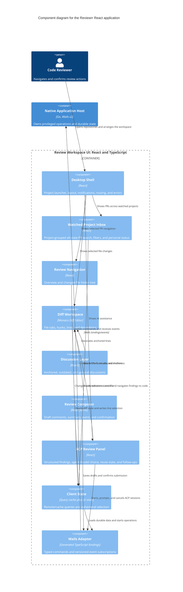

# React frontend components

The frontend owns interaction and presentation state. All durable and privileged operations cross the typed Wails boundary.

## Interaction constraints

- The three primary panels remain independently resizable and keyboard reachable.
- PR and file navigation must not discard unsaved local drafts.
- AI output, GitHub content, and local human drafts use distinct visual treatments and labels.
- AI findings stay in the right panel and never create diff decorations or comments.
- A submit action always opens a final confirmation showing destination repository, PR number, head revision, event, summary, and comment count.
- Error boundaries isolate Monaco and ACP rendering failures from the PR inbox and draft composer.

## Key

- Components are frontend feature boundaries bundled into one React application.
- The Wails adapter is the only frontend component aware of generated native bindings and raw event names.
