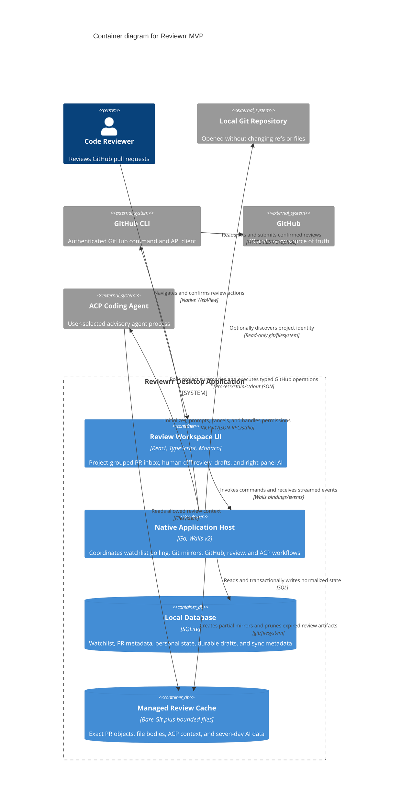

# Container architecture

This diagram separates the watched-project UI, native Go host, durable database, and seven-day managed review cache from external processes.

## Container responsibilities

| Container | Durable | May write source repository | May write GitHub |
| --- | --- | --- | --- |
| React UI | No | No | No |
| Go host | Process lifetime | No | Only after human submit confirmation, through `gh` |
| SQLite | Yes | Not applicable | No |
| Managed review cache | Rebuildable after seven inactive days | No; separate application cache | No |

## Key

- **Container:** a separately executing application or data store.
- **System boundary:** code and data shipped as Reviewrr.
- **External system:** local software/data not packaged as an internal Reviewrr container.
