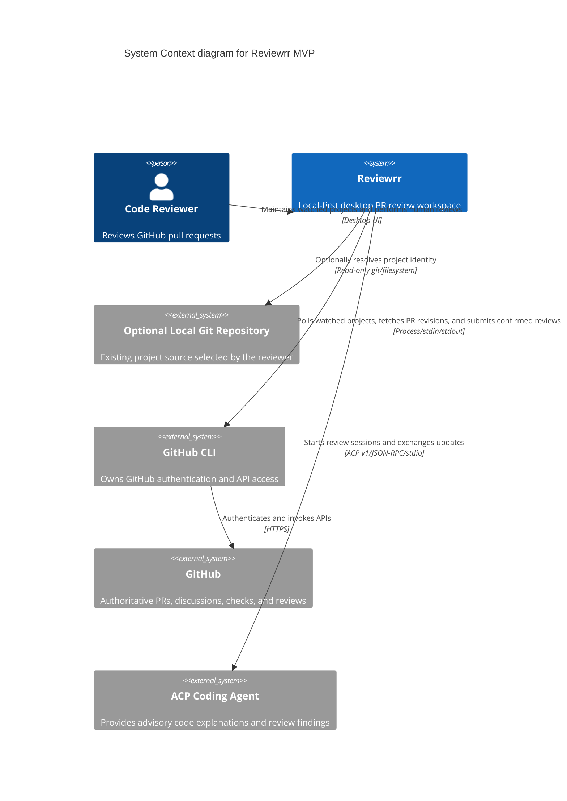

# System context

This diagram shows Reviewrr as a local desktop system that watches several GitHub projects while focusing on one PR revision at a time.

## Notes

- GitHub is the remote source of truth.
- Reviewrr does not receive or store the token used by `gh`.
- Reviewrr polls watched projects only while the desktop application is open.
- The ACP agent cannot submit a GitHub review or annotate the diff; only the reviewer can trigger GitHub comments through Reviewrr.
- “Read-only repository” is a Reviewrr contract. A configured local agent is a trusted process unless separately sandboxed.

## Key

- **Person:** the human reviewer.
- **System:** Reviewrr, the product being designed.
- **External system:** software or data owned outside Reviewrr's runtime boundary.
- **Arrow:** initiator and purpose of a one-way interaction.
