# Desktop deployment

The MVP has no Reviewrr cloud service. All Reviewrr code and data run on the reviewer's machine; `gh` is the only component that communicates with GitHub.

```mermaid
C4Deployment
  title Deployment diagram for Reviewrr MVP on a developer workstation

  Deployment_Node(workstation, "Reviewer Workstation", "macOS first; Windows and Linux later", "User-controlled desktop environment") {
    Deployment_Node(reviewrrProcess, "Reviewrr Process", "Wails v2 desktop executable", "Go host with embedded frontend assets") {
      Container(reactUi, "Review Workspace UI", "React, TypeScript, Monaco", "Rendered in the system WebView")
      Container(goHost, "Native Application Host", "Go", "Project, GitHub, storage, diff, review, and ACP logic")
    }

    Deployment_Node(appData, "Application Data Directory", "Per-user persistent storage", "Survives upgrades and cache cleanup") {
      ContainerDb(sqlite, "Local Database", "SQLite", "Watchlist, lightweight metadata, personal state, durable drafts, and preferences")
    }

    Deployment_Node(cacheDir, "Application Cache Directory", "Per-user rebuildable storage", "Reviewrr-managed and safe to prune by policy") {
      ContainerDb(mirrorStore, "Managed Git Mirrors", "Bare or partial Git repositories", "Exact base/head objects without a working tree")
      ContainerDb(reviewCache, "PR and AI Context Cache", "Files", "Detailed snapshots, file bodies, ACP context, and AI artifacts")
    }

    Deployment_Node(tooling, "Installed Developer Tools", "External executables", "Resolved from validated configuration or PATH") {
      Container(gitCli, "Git", "git executable", "Read-only local discovery and managed-mirror fetch/object access")
      Container(ghCli, "GitHub CLI", "gh executable", "Authentication and GitHub API access")
      Container(acpAgent, "ACP Coding Agent", "Kiro, OpenCode, or custom", "Reviewer-selected advisory process over ACP stdio")
    }

    Deployment_Node(projectDir, "Optional Local Project Directory", "Local filesystem", "A user-selected source worktree") {
      ContainerDb(localRepo, "Local Git Repository", "Git objects and working tree", "Inspected without modification")
    }
  }

  System_Ext(github, "GitHub", "Source of truth for repositories, PRs, comments, checks, and reviews")

  Rel(reactUi, goHost, "Calls native methods and receives events", "Wails bridge")
  Rel(goHost, sqlite, "Persists durable state and cache indexes", "SQL")
  Rel(goHost, reviewCache, "Writes seven-day rebuildable PR and ACP artifacts", "Filesystem")
  Rel(goHost, gitCli, "Requests discovery, fetch, and object reads", "Process")
  Rel(gitCli, localRepo, "Reads repository identity and objects only", "Filesystem")
  Rel(gitCli, mirrorStore, "Creates/fetches managed bare mirrors and reads exact revisions", "Filesystem")
  Rel(goHost, ghCli, "Requests GitHub reads and confirmed review writes", "Process/stdin/stdout")
  Rel(ghCli, github, "Calls authenticated APIs and resolves repository access", "HTTPS")
  Rel(goHost, acpAgent, "Exchanges revision-scoped advisory sessions", "ACP v1/stdio")
  Rel(acpAgent, reviewCache, "Reads only the materialized disposable context exposed by Reviewrr", "Filesystem")

  UpdateLayoutConfig($c4ShapeInRow="3", $c4BoundaryInRow="1")
```

## Packaging assumptions

- The Wails binary embeds the compiled React assets.
- `git`, `gh`, and at least one supported ACP agent are external prerequisites; Reviewrr does not bundle credentials.
- Reviewrr validates tool versions, agent capabilities, available models, and GitHub authentication during onboarding or selection.
- The first signed package is proposed for macOS; the domain and integration boundaries remain portable.
- SQLite schema migrations run before the UI issues data-dependent operations.
- Managed mirrors, detailed PR content, ACP transcripts, AI output, and temporary learning expire no later than seven days after the last explicit related project/branch/PR open. Polling does not extend that clock.
- Regenerable cache has a 5 GiB default budget and prunes least-recently-opened cache groups first when that budget is exceeded.
- Watchlist references, lightweight identity/state, and human-authored drafts remain in application data until explicitly removed, submitted, or discarded.

## Key

- Application data is durable; cache data is rebuildable and governed by the seven-day retention policy.
- A local source worktree is optional. URL-first review uses a Reviewrr-managed mirror and never creates a managed working tree.
- The disposable ACP context is materialized separately from the managed Git mirror so the agent never receives mirror internals as its workspace.
