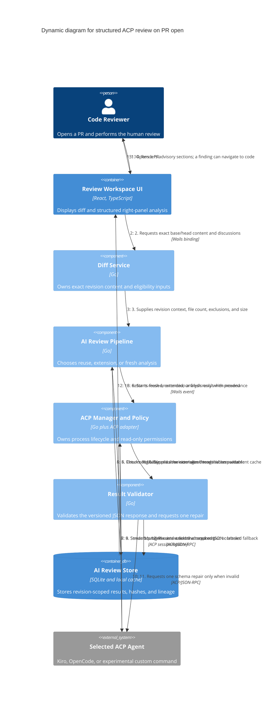

# Structured ACP review flow

This flow starts only when the reviewer opens an eligible PR. Agent output is advisory, appears only in the right panel, and is bound to the exact PR head revision.

## Eligibility and reuse rules

- Automatic analysis runs only after an explicit PR open, only for PRs with fewer than 30 changed files, and only while the bounded text/context budget is satisfied.
- Binary, generated, vendor, oversized, or unavailable files are excluded and recorded in `skippedFiles`.
- Polling never starts an agent.
- A result is reusable only when head SHA, agent, model, prompt/schema version, and content hash match.
- New discussions, reviewer feedback, or newly available relevant context can extend an existing result. A revision, agent/model, schema, or incomplete-result change requires fresh analysis.
- Reused, extended, fresh, invalid, and fallback states remain visible to the reviewer.

## Failure branches

- Ineligible PR: do not start ACP; explain the file-count, content-size, or unsupported-file reason and retain manual file/selection actions.
- Unsupported ACP version, model, or required capability: fail with an actionable compatibility or setup explanation.
- Agent requests a path outside the disposable context root, a filesystem write, or a terminal: deny and record normalized metadata.
- Invalid JSON: issue exactly one repair prompt; if it remains invalid, preserve and clearly label the unstructured fallback.
- Agent exit or malformed protocol data: terminate the connection, preserve useful received output, and keep the human review workspace usable.
- PR head change: cancel active work, archive its result under the old SHA, switch the UI immediately, and evaluate the new revision independently.

## Trust statement

ACP permission handling controls protocol-mediated actions; it does not sandbox the operating-system process. Reviewrr launches only a reviewer-selected agent and makes that trust boundary explicit.

## Key

- The AI response contract is defined in [AI review result v1](ai-review-result-v1.md).
- Findings exist only in the right panel. Navigation to a diff line does not create an annotation, draft, or GitHub comment.
- The disposable agent context is separate from both a user's source worktree and Reviewrr's managed Git mirror.
