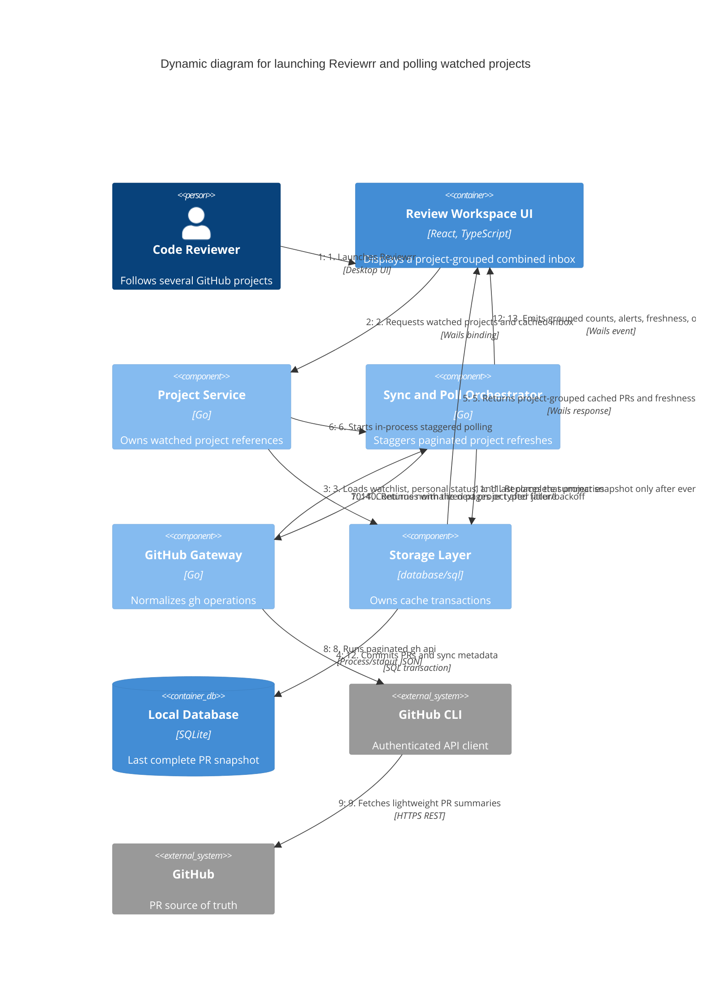

# Watched-project synchronization flow

The synchronization flow is cached-first, staggered across watched projects, and active only while Reviewrr is open.

## Failure branches

- If authentication fails, cached data remains visible and is marked stale.
- If any page fails or is malformed, that project's previous complete summary snapshot remains active.
- Ignored PRs synchronize but do not create attention counts or notifications.
- Quitting Reviewrr cancels all poll operations and leaves no daemon or helper process.
- Polling does not extend the seven-day last-explicit-open cache TTL.

## Key

- Sequence numbers are part of relationship labels.
- SQLite commits occur only after a complete authoritative response for the requested scope.
