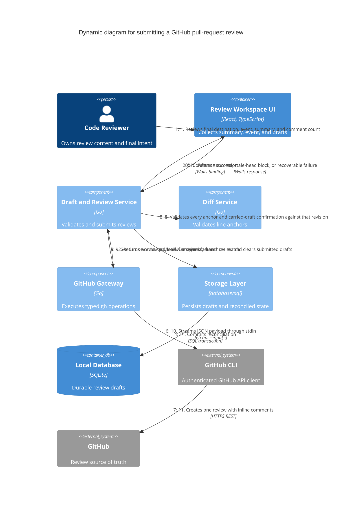

# GitHub review submission flow

Review submission is the only GitHub write in the MVP. It is explicit, revision checked, atomic, and recoverable.

## Invariants

- Head-SHA mismatch stops before the GitHub write.
- Invalid or missing line coordinates stop before the GitHub write.
- Carried drafts require explicit confirmation; ambiguous, orphaned, or old-revision drafts cannot enter the payload.
- Summary and review event are human-confirmed immediately before the write.
- Failure before confirmed success leaves local drafts unchanged.
- An ambiguous timeout triggers reconciliation before a retry is offered.
- No ACP component participates in this flow.

## Key

- The only outbound write is step 11.
- Review text is JSON data on stdin, never shell syntax or command-line flags.
