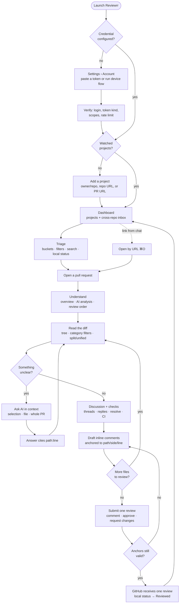
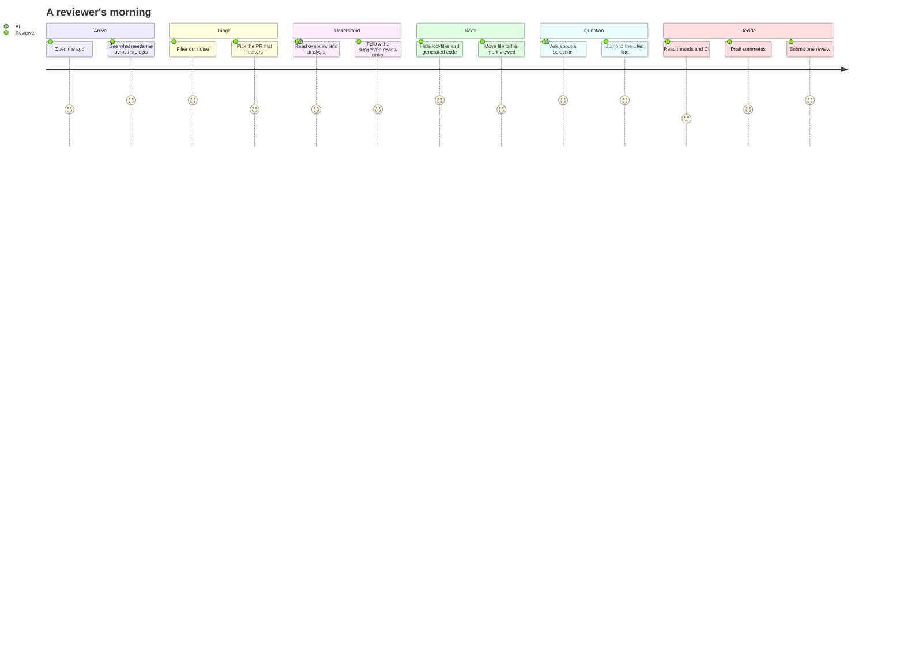

# Reviewrr user journey

**Last updated:** 2026-09-06

One reviewer, one morning, across the projects they follow. Every stage below names the code that
implements it, so this map stays a description of the app rather than a wish.

## The whole loop

## Stage by stage

| Stage | What the reviewer does | Where it lives |
| --- | --- | --- |
| **Connect** | Paste a token or run the device flow; see who they are, the credential kind, what it can do, and remaining rate limit | `Views/Settings/AccountSettingsView.swift`, `ViewModels/AuthModel.swift`, `Services/GitHubAuth.swift` |
| **Watch** | Add projects by `owner/repo`, repo URL, or PR URL, validated before they are added; mute or remove later | `Views/Dashboard/AddProjectSheet.swift`, `Views/Dashboard/ProjectSidebarView.swift`, `Services/Inbox/WatchlistStore.swift` |
| **Arrive** | Cached projects render immediately, then staggered refreshes fill the inbox; per-project freshness and errors are visible, never hidden behind stale data | `ViewModels/DashboardModel.swift`, `Services/Inbox/PollingCoordinator.swift` |
| **Triage** | Group by project or reviewer bucket; filter by state, author, label, review-requested, local status, updated-within; search everything cached | `Services/Inbox/InboxFiltering.swift`, `Views/Dashboard/InboxFilterBar.swift`, `Views/Dashboard/InboxRowView.swift` |
| **Open** | A row, ⌘O by URL, or the most recent PR at launch when "Start on dashboard" is off | `Views/RootView.swift`, `Views/OpenPullRequestSheet.swift`, `ViewModels/AppModel.swift` |
| **Understand** | Title, description, CI rollup, review decision in the header; AI analysis or the heuristic pass gives an overview, a review order, and findings by severity | `Views/PRHeaderView.swift`, `Views/AI/AnalysisView.swift`, `Services/AI/PRAnalyzer.swift` |
| **Read** | Folder tree with categories, lockfiles and generated files hidden by default, split or unified diff, word-level intra-line highlighting, context expansion, viewed marks and per-category progress | `Views/Workspace/**`, `Views/DiffView.swift`, `Services/FileClassifier.swift`, `Services/SyntaxHighlighter.swift` |
| **Question** | Ask scoped to a selection, a file, or the PR; streamed answer with `path:line` citations that navigate the diff; turn an answer into a draft comment | `Views/AI/AskView.swift`, `ViewModels/AIModel.swift`, `Services/AI/Citations.swift` |
| **Discuss** | Threads at their anchors with resolution and outdated state, replies, resolve/unresolve, a merged timeline, and the check runs with the failing one first | `Views/Conversation/**`, `Services/ThreadsClient.swift`, `Services/ChecksClient.swift` |
| **Draft** | Inline drafts anchored to path, side, line, and the head SHA they were written against; kept on disk until submitted or discarded | `Views/CommentViews.swift`, `Services/DraftStore.swift` |
| **Submit** | One review — comment, approve, or request changes — after every anchor is re-validated against the current patch; failure keeps every draft | `Views/SubmitReviewSheet.swift`, `Services/GitHubClient.swift` |
| **Return** | Local status becomes `Reviewed`; polling keeps the inbox current while the app is open; ignored PRs stay quiet | `ViewModels/DashboardModel.swift`, `Models/LocalPRStatus.swift`, `Services/Inbox/ActivityNotifier.swift` |

## Where the journey is deliberately bounded

- AI context is PR-scoped. There is no repository-wide retrieval, and the UI does not imply one.
- Polling stops when the app quits. No daemon, no menu-bar helper.
- Reviewrr never merges, checks out, commits, pushes, or edits code.
- AI never approves, rejects, posts, or edits — a human promotes an answer to a draft, and a human
  submits.

## Friction this design removes

| Old friction | What replaces it |
| --- | --- |
| Opening each repository to find what needs review | One inbox across every watched project, plus reviewer buckets |
| Losing the thread of a PR after a force push | Drafts keep their head SHA and are re-validated before submission |
| Scrolling past 1,200 lines of lockfile | Category classification with lockfiles and generated files hidden by default, and a visible count of what is hidden |
| "Is this pattern used elsewhere?" → leave the app | Ask, scoped to the selection, answering with citations that navigate |
| Not knowing whether you have actually looked at everything | Viewed marks and per-category review progress |
| Guessing whether a thread was resolved | Real resolution state from GraphQL, or an honest "unknown" when it is unavailable |
